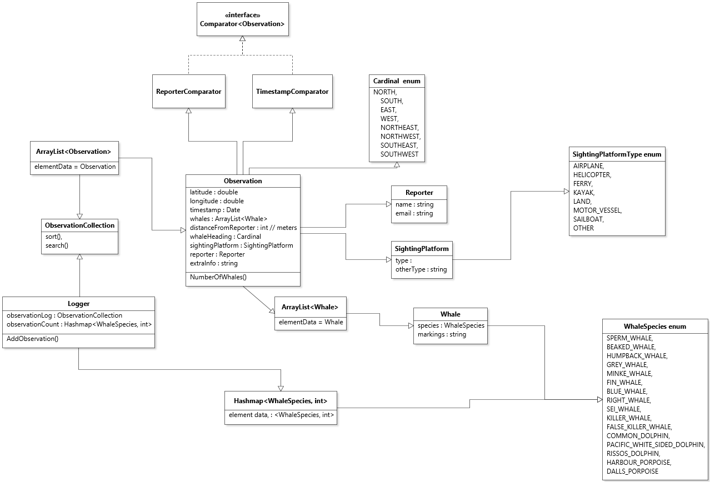
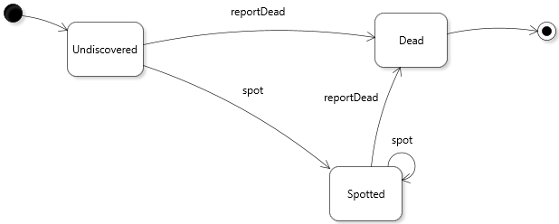

## Diagrams

#### Class Diagram

#### Whale State Diagram

Please read thru the [overall exercises overview](https://github.com/SENG330/course/blob/master/exercises/Exercises.md).

## Exercise 4
In this exercise we will begin to think about what to do with error conditions in our system, and the possible states our system can be in.

1. As a team, choose one member's previous codebase (from Ex3) as a starting point. Building on the work from Ex3, correct their code based on the TA feedback. Since you are in new groups, you will have to spend some time reading and understanding the code chosen. Choose one team member to capture, in the ADR, why that codebase was chosen, what that codebase does well, and what it does poorly.
2. Pick two significant stateful objects in your design from Ex3, and capture state diagrams for each one (2 diagrams). `Observation` and `Whale` might be good choices. Your diagrams must contain at least 3 states, and show the state names and transitions between the states (like Fig 4.2 in the book). Ensure your transitions are implemented in the code (e.g., the shuffle transition is a method in the Deck class).
3. In your ADR explain why you chose the transitions and states for each object (so 2 ADR decisions). Your rationale should explain how the implementation will handle potential error states.
<!-- 4. Override `equals` and `hashCode` for a Whale object so that Whales can be compared. In your ADR explain what equality means in your domain context (e.g., when should 2 whales be treated as equal? Is species sufficient? Dorsal fin shape?). -->
4. In the ADR, carefully document at least one aspect of the code where it is possible to return a null value. Document this in the ADR, and then replace this call with the Java language element `Optional`. In the ADR be sure to document how you used Optionals.

### Notes:
Don't underestimate how long the first task will take. Reading a large codebase can be difficult. I suggest doing the review as a team, so that the person most familiar with it can carefully explain it.

I have added a [Github CI action](https://github.com/features/actions) to this template. We will discuss in class (located in `.github/workflows/gradle.yml`) - you shouldn't have to do anything with it.

### Learning Objectives
- reading other people's code.
- object state, optional types.

### Deliverables
* The State diagrams that represents the states of two objects.
* The ADR for task 1, task 3, and task 4
* Code updated to shown State diagram transitions if necessary.
* Code, showing Optionals.

## Due
- We will mark the last commit made before **October 16 at 11:59pm**. If that last commit was a mess, let us know. Make
 sure your code compiles!
- By midnight Oct 18, submit your team peer review form (link to follow).
